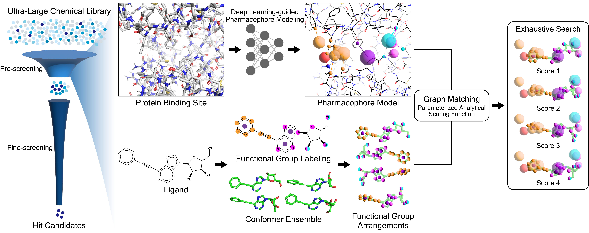

# PharmacoNet: Accelerating Large-Scale Virtual Screening by Deep Pharmacophore Modeling

Accepted in ***NeurIPS Workshop 2023 (AI4D3 | New Frontiers of AI for Drug Discovery and Development)*** [[arxiv](https://arxiv.org/abs/2310.00681)]

Official Github for ***PharmacoNet: Accelerating Large-Scale Virtual Screening by Deep Pharmacophore Modeling*** by Seonghwan Seo* and Woo Youn Kim.

1. Fully automated protein-based pharmacophore modeling based on image instance segmentation modeling
2. Coarse-grained graph matching at the pharmacophore level

PharmacoNet is an extremely rapid yet reasonably accurate structure-based scoring function with high generation ability.

If you have any problems or need help with the code, please add an issue or contact [shwan0106@kaist.ac.kr](mailto:shwan0106@kaist.ac.kr).




## Quick Start

```bash
# Download Pre-trained Model
sh ./download-weights.sh

# Pharmacophore Modeling
python modeling.py -r <RECEPTOR_PATH> --autobox_ligand <LIGAND_PATH> -p <OUT_PHARMACOPHORE_MODEL_PATH> 
python modeling.py -r <RECEPTOR_PATH> --center <X> <Y> <Z> -p <OUT_PHARMACOPHORE_MODEL_PATH> --cuda	# CUDA Acceleration

# Scoring with a single ligand SMILES
python scoring.py -p <PHARMACOPHORE_MODEL_PATH> -s <SMILES> --num_conformers <NUM_CONFORMERS>

# Scoring with a ligand SMILES file. (see ./examples/example.smi)
python scoring_file.py -p <PHARMACOPHORE_MODEL_PATH> -s <SMILES_FILE> --num_conformers <NUM_CONFORMERS> --num_cpus <NUM_CPU>
```

#### Example

```bash
# Pharmacophore Modeling for KRAS(G12C) - PDBID: 6OIM
python modeling.py -r ./examples/6OIM_protein.pdb --autobox_ligand ./examples/6OIM_ligand.sdf -p ./examples/6OIM_model.json

# Scoring
python scoring.py -p ./examples/6OIM_model.json -s 'c1ccccc1' --num_conformers 2
python scoring_file.py -p ./examples/6OIM_model.json -s ./examples/example.smi --num_conformers 10
```


## Environment

```shell
# Required python>=3.9, Best Performance at 3.11
conda create --name pmnet python=3.11
conda activate pmnet
conda install openbabel

pip install torch torchvision # torch >= 1.13, CUDA acceleration is available. 1min for 1 cpu, 10s for 1 gpu
pip install rdkit biopython omegaconf timm numba # Numba is optional, but recommended.
pip install molvoxel # https://github.com/SeonghwanSeo/molvoxel.git
```


## Scoring

We provide two simple example scripts for scoring. However, it can be easily included in your custom script via the python code below.

\* Multiprocessing is allowed. See [`./scoring_file.py`](./scoring_file.py)

#### Example python code

```python
from src import PharmacophoreModel
from openbabel import pybel

model = PharmacophoreModel.load(<PHARMCOPHORE_MODEL_PATH>)
pbmol = pybel.readstring('smi', <LIGAND_SMILES>)

# NOTE: Scoring with RDKit ETKDG Conformers
def scoring_etkdg_conformers(model, pbmol, smiles, num_conformers):
    from rdkit import Chem
    from rdkit.Chem import AllChem
    rdmol = Chem.MolFromSmiles(smiles)
    rdmol = Chem.AddHs(rdmol)
    AllChem.EmbedMultipleConfs(rdmol, num_conformers, AllChem.srETKDGv3())
    rdmol = Chem.RemoveHs(rdmol)
    return model.scoring(pbmol, rdmol)

# NOTE: Scoring with custom ligand conformers.
def scoring_own_conformers(model, pbmol, atom_positions):
    # atom_positions: [NUM_CONFORMERS, NUM_ATOMS, 3]
    return model.scoring(pbmol, atom_positions=atom_positions)
```


## Citation

Paper on [arxiv](https://arxiv.org/abs/2310.00681)

```
@article{seo2023pharmaconet,
  title = {PharmacoNet: Accelerating Large-Scale Virtual Screening by Deep Pharmacophore Modeling},
  author = {Seo, Seonghwan and Kim, Woo Youn},
  journal = {arXiv preprint arXiv:2310.00681},
  year = {2023},
  url = {https://arxiv.org/abs/2310.00681},
}
```

